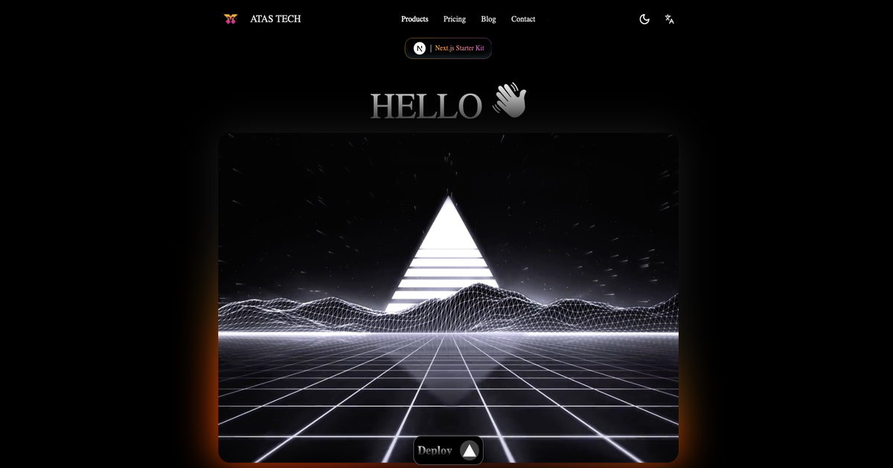

# ATAS Starter Kit ✨

### 🖱 One Click

[](https://vercel.com/new/clone?repository-url=https://github.com/ATASTECH/Atas-Starter-Kit.git)
## 🚀 Getting Started

### 📋 Installation

🎯 Manually clone the repository:

```bash
git clone https://github.com/ATASTECH/Atas-Starter-Kit.git
cd Atas-Starter-Kit
npm install
```
🤩 First, run the development server:

```bash
npm run dev
```

### Setup

Follow these steps to set up your project:

Open [http://localhost:3000](http://localhost:3000) with your browser to see the result.

You can start editing the page by modifying `app/page.tsx`. The page auto-updates as you edit the file.

This project uses [`next/font`](https://nextjs.org/docs/basic-features/font-optimization) to automatically optimize and load Inter, a custom Google Font.

## ⭐ Features

### 🐭 Frameworks

- **[Next.js](https://nextjs.org/)** - The React Framework for the Web (with **App Router**)

### 🐮 Platforms

- **[Vercel](https://vercel.com/)** – Deploy your Next.js app with ease

### 🐯 Enterprise Features

- **[i18n](https://nextjs.org/docs/app/building-your-application/routing/internationalization)** - Support for internationalization
- **[Atas/ui](https://ui.atastech.com/)** – Re-usable components built using Shadcn UI, Tailwind CSS, Framer Motion

### 🐒 UI

- **[Atas/ui](https://ui.atastech.com/)** – Re-usable components built using Shadcn UI, Tailwind CSS, Framer Motion
- **[Tailwind CSS](https://tailwindcss.com/)** – Utility-first CSS framework for rapid UI development
- **[Shadcn/ui](https://ui.shadcn.com/)** – Re-usable components built using Radix UI and Tailwind CSS
- **[Framer Motion](https://framer.com/motion)** – Motion library for React to animate components with ease
- **[Lucide](https://lucide.dev/)** – Beautifully simple, pixel-perfect icons
- **[next/font](https://nextjs.org/docs/basic-features/font-optimization)** – Optimize custom fonts and remove external network requests for improved performance

### 🐴 Code Quality

- **[TypeScript](https://www.typescriptlang.org/)** – Static type checker for end-to-end type safety
- **[Prettier](https://prettier.io/)** – Opinionated code formatter for consistent code style
- **[ESLint](https://eslint.org/)** – Pluggable linter for Next.js and TypeScript

### 🐑 Performance

- **[Vercel Analytics](https://vercel.com/analytics)** – Real-time performance metrics for your Next.js app

## 📜 License

This project is licensed under the MIT License. For more information, see the [LICENSE](./LICENSE) file.
